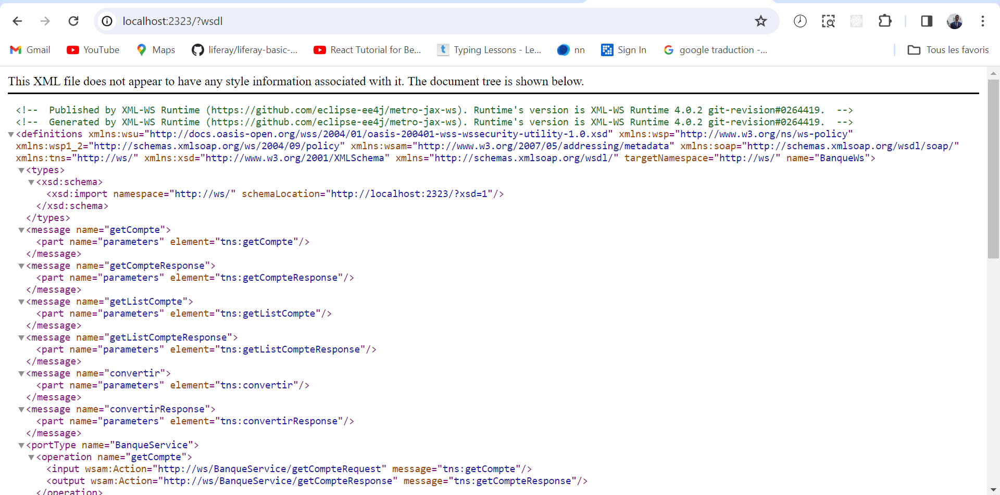
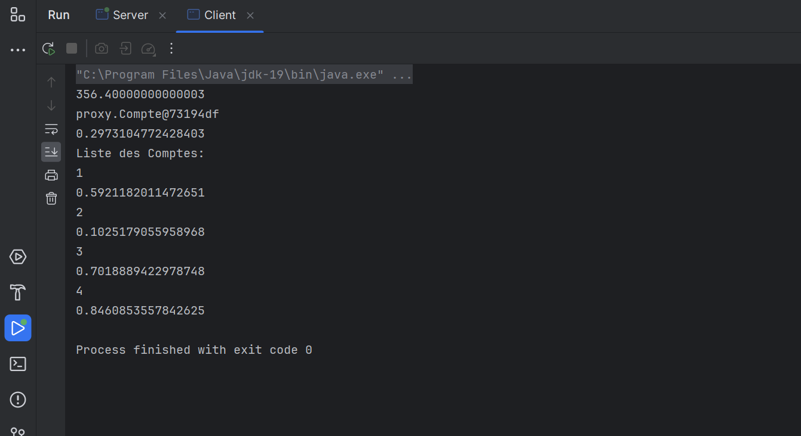

# Travail Pratique SOAP

## Introduction

Ce document décrit le travail pratique réalisé dans le cadre du TP sur SOAP.

## Objectif

L'objectif de ce TP est de comprendre et de mettre en œuvre des services web SOAP.

## Structure du Projet

<h2>Le projet est structuré comme suit :
2 folder:</h2>
-Serverws responsable a creer le server et mettre le web Service et genere wsdl
<h3>Voici image de Wsdl</h3> 

<h3>le traitement sur SOAP:</h3>
<h4>Methode de conversion</h4>

<h4>Mehode de retouner un Compte D'apres un code</h4>

<h4> Methode qui permet de retourner une liste de Compte</h4>

<h3>-ClientWS responsable a consommer le WebService</h3>

